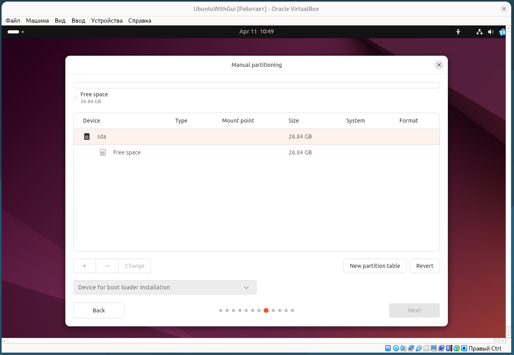
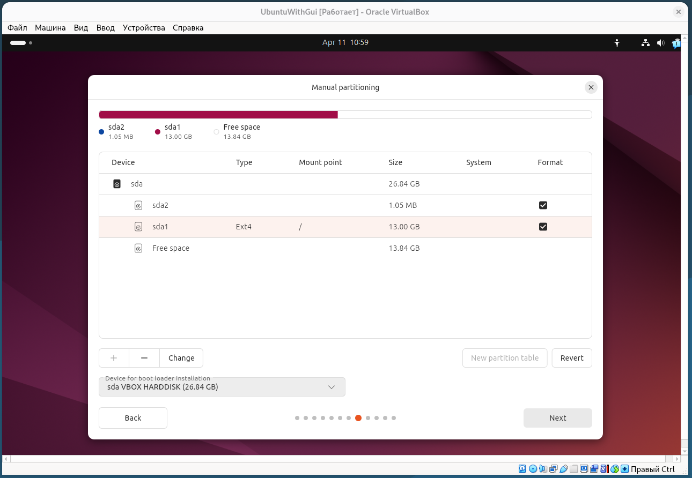
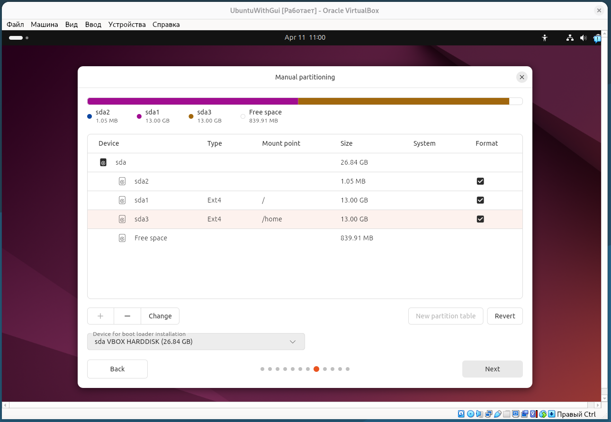
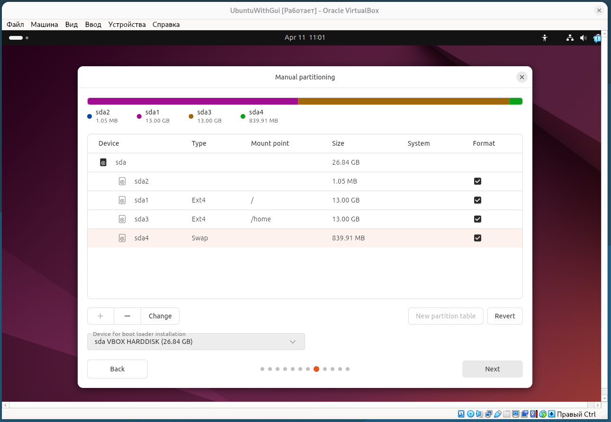
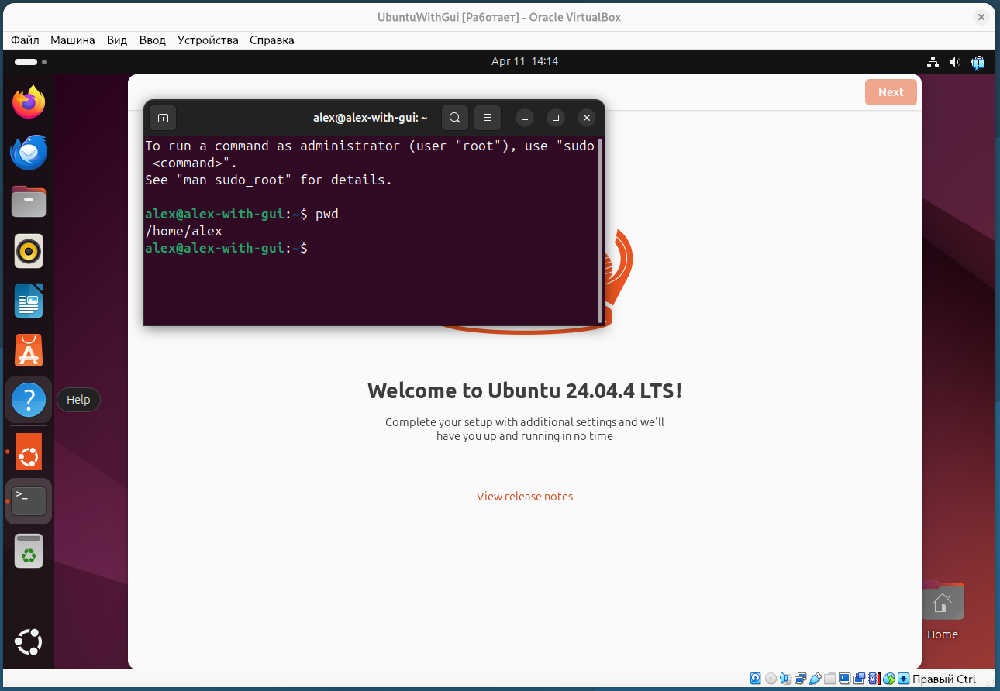
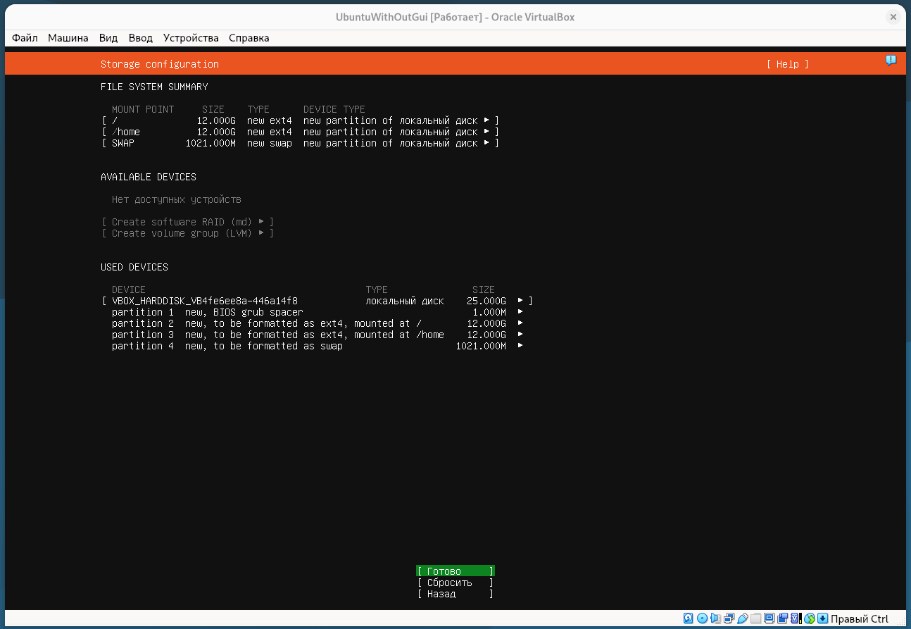
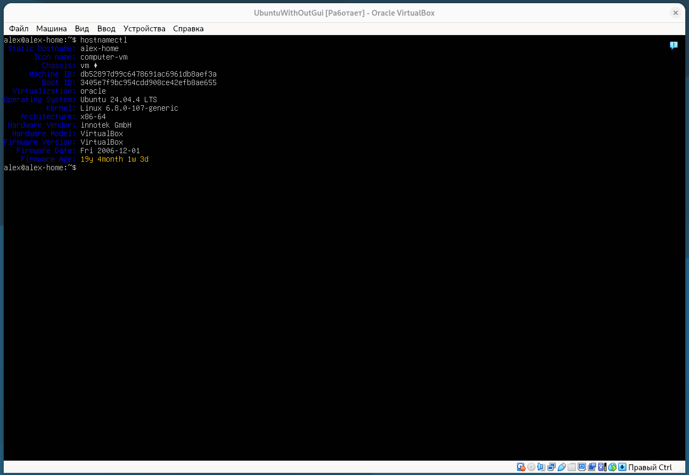

## Домашняя работа HW-03 Введение в DevOps2.Операционные системы. Часть 1

### 1. Создать виртуальную машину и установите образ любой версии Ubuntu
### 2. Необходимо проделать установку в режиме GUI
### 3. Добавлять в отчёт только скриншоты процесса разметки диска

### Размечаем диск

### Корневой раздел

### Домашний раздел

### Файл подкачки

### Работающая система

## Сделать то же самое, только установить ОС без графического окружения с командной строкой

###  Разметка диска

### Работающая система

