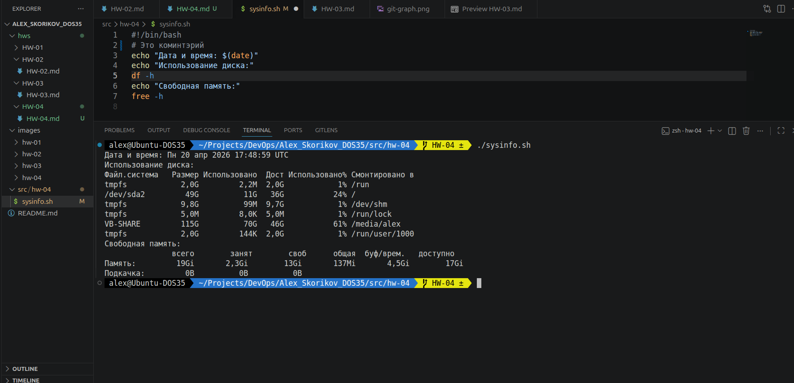
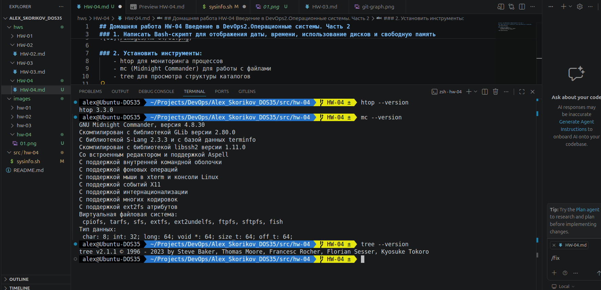
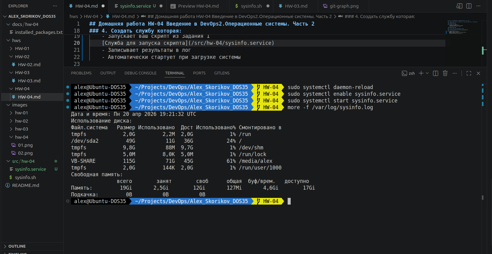

## Домашняя работа HW-04 Введение в DevOps2.Операционные системы. Часть 2

### 1. Написать Bash-скрипт для отображения даты, времени, использование дисков и свободную память

### 2. Установить инструменты:
    - htop для мониторинга процессов
    - mc (Midnight Commander) для работы с файлами
    - tree для просмотра структуры каталогов 

### 3. Сохранить список установленных пакетов в файл

[Список установленных пакетов](./docs/installed_packages.txt)

### 4. Создать службу которая:
    - Запускает ваш скрипт из Задания 1

[Служба для запуска скрипта](./src/sysinfo.service)

    - Записывает результаты в лог
    - Автоматически стартует при загрузке системы

#### Результат работы службы (лог):

